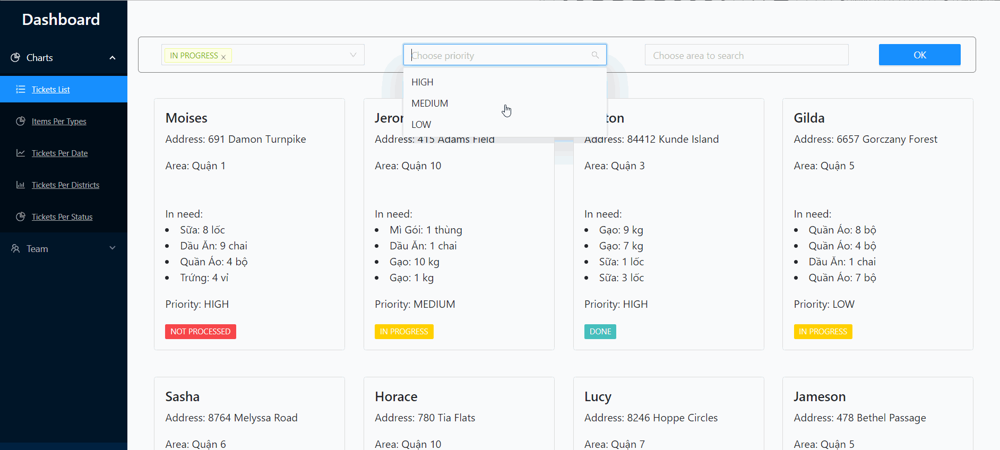

## COVID-19 Charity Hackathon

Live-demo website: https://hackathon-jaguar.netlify.app/

Design a web application to manage the charity tickets for helper teams. Users can filter and sort the tickets with a list, see tickets in multiple charts and tables.

Backend Github: https://github.com/cqnguy23/Hackathon2.0

Backend Deployed Link: https://hackathon-jaguar.herokuapp.com/

Flow of website:

|  |
| :----------------------------------: |
|           _Website's Flow_           |

## Contributors:

Chuong Nguyen

Thao Nguyen

Van Nguyen

Hoang Nguyen
